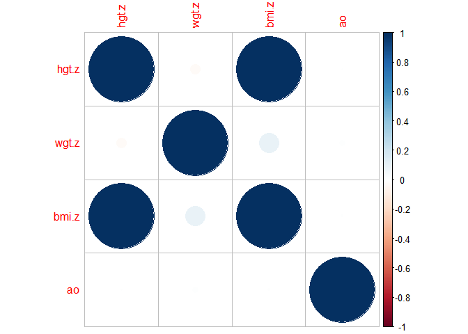
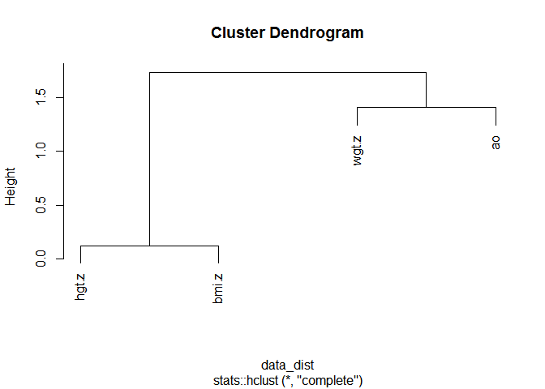

<!-- README.md is generated from README.Rmd. Please edit that file -->

# rmissingno

<!-- badges: start -->
<!-- badges: end -->

The goal of rmissingno is to emulate some of the interesting missing
data exploration tools available in the python package `missingno`. Code
is more or less from scratch, all the bad ideas and terrible
implementation is mine. API is deeply unstable and likely to change.

## Installation

You can install the development version from
[GitHub](https://github.com/) with:

``` r
# install.packages("devtools")
devtools::install_github("mattsq/rmissingno")
```

## Example

I currently (badly) implement two of the methods from the package.

The first uses `corrplot` to plot the correlations between missing data
in various variables in a dataframe:

``` r
library(rmissingno)
library(mice)
#> 
#> Attaching package: 'mice'
#> The following object is masked from 'package:stats':
#> 
#>     filter
#> The following objects are masked from 'package:base':
#> 
#>     cbind, rbind
data("tbc")

rmissingno::plot_missing_correl(tbc)
```



The second uses hierarchical clustering to find associations between
missingness, to draw out more complex patterns than pairwise correlation
might hide:

``` r
rmissingno::plot_missing_hclust(tbc, distance = "euclidean")
```


